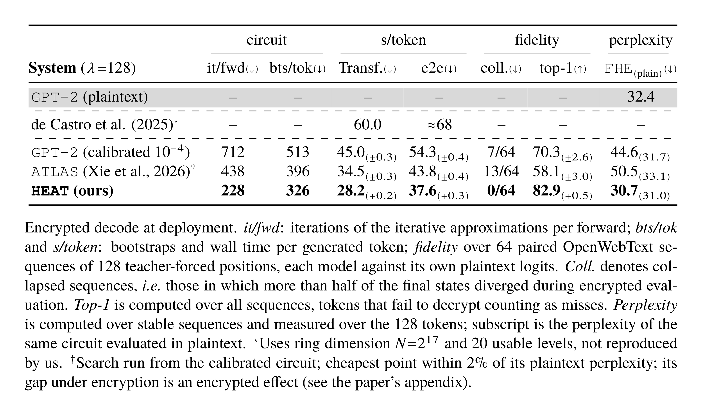
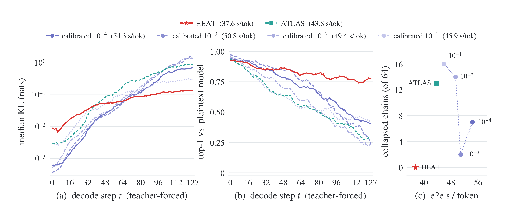

<p align="center">
  <a href="https://www.uniroma1.it/en"></a>
  &nbsp;&nbsp;&nbsp;&nbsp;&nbsp;&nbsp;&nbsp;&nbsp;&nbsp;&nbsp;
  <a href="https://gladia.di.uniroma1.it">
    <picture>
      <source media="(prefers-color-scheme: dark)" srcset="assets/gladia-logo-white.svg">
      <source media="(prefers-color-scheme: light)" srcset="assets/gladia-logo.svg">
      
    </picture>
  </a>
</p>

<h1 align="center">HEAT: Faster Fully Homomorphic Inference via Approximations-Weights Co-Adaptation</h1>

<p align="center">
  <a href="https://github.com/gladia-research-group/perseus">Perseus backend</a> ·
  <a href="#0-install">Quickstart</a> ·
  <a href="#citation">Citation</a> ·
  <a href="LICENSE">MIT license</a>
</p>

Fully homomorphic encryption (FHE) allows a server to run a language model directly on encrypted user prompts, but current approaches remain prohibitively slow. Ciphertexts natively support only addition, multiplication, and rotation, and multiplications may be composed only to a bounded depth before a costly bootstrapping operation is required to continue. Every nonlinearity must therefore be approximated by an iterative method; each iteration increasing the number of multiplications. A higher iteration count buys precision but exhausts the available depth more frequently and thus triggers more bootstraps, which dominate latency.

We introduce **Homomorphic Encryption-Aware Training (HEAT)**, a *fine-tuning* method that makes the per-nonlinearity iteration counts *learnable*, enabling them and the model weights to co-adapt during training. HEAT optimizes iterations with respect to the task objective, allowing the model to adapt to approximation errors encountered during inference without architectural changes or retraining from scratch. We further relate iteration count to quantization bit width and bound, at fixed weights, the gap between our objective and quantization-aware training. On encrypted GPT-2 decoding, HEAT reduces iterations by 3.1×, bootstraps by 1.6×, and end-to-end latency by 1.4×, while improving decode agreement over the calibrated encrypted baseline.

This repository contains the code necessary to replicate the depth reducing training experiment and the bootstrap plans of the encrypted runs. Encrypted inference runs on the [Perseus](https://github.com/gladia-research-group/perseus) backend, vendored here as `src/perseus` and pinned to the `heat-baseline` tag.

## Results

Encrypted GPT-2 decoding at deployment.

<p align="center">
  <a href="assets/results-table-light.png">
    <picture>
      <source media="(prefers-color-scheme: dark)" srcset="assets/results-table-dark.png">
      <source media="(prefers-color-scheme: light)" srcset="assets/results-table-light.png">
      
    </picture>
  </a>
</p>

Per-position fidelity of each encrypted circuit against its own plaintext logits, over 64 sequences of 128 teacher-forced decode steps:

<p align="center">
  <a href="assets/he128_ladder.png"></a>
</p>

*(a) Median encrypted KL over the sequences that do not collapse. The calibrated circuits start near-exact and degrade with position, the looser tolerances faster; HEAT starts higher and stays almost flat. (b) Top-1 agreement over all sequences, the calibrated ladder falls to 23–42% by t = 128 while HEAT ends at 78%. Per-step latency is position-flat for every circuit under the Cachemir layout. (c) Collapsed sequences of 64 per method, i.e. sequences where more than 50% of the tokens couldn't be decrypted.*

## Layout

- `src/he_aware_training/`
  - `modules/` the learnable layers. `learnable_components.py` is the ponder machinery that makes depth differentiable, `mem_eff_ponder_functions.py` its memory-efficient autograd, `learnable_{thor,vit}_layers.py` the per-approximation attention.
  - `approximation/classic.py` classical approximation machinery.
  - `scripts/` pipeline entry points, with `preprocess/` for calibration, data preparation and export
  - `utils/` data, surgery, loss, checkpointing, training loop.
- `configs/` Hydra configs. `he_aware_train{,_vit}.yaml` are the training entries; `model/approximation/` holds the circuit descriptions.
- `plans/<model>/<method>/` one directory per method: the deploy `config.json` and its bootstrap `plan/`.
- `scripts/` scripts for FHE backend porting.
- `src/perseus/` the FHE backend (git submodule, tag `heat-baseline`). Reads the deploy
  config and the exported weights; not needed for training or calibration.

## Pipeline

Every stage is a Hydra entry point tuned by Hydra overrides. For training, the arm is
selected by `--config-name he_aware_train{,_vit}`, not by `model=`: the entry point
pins `config_name="he_aware_train"`, so `model=vit` alone would compose the ViT model
against GPT-2's dataset, trainer and regularizer. The other stages take `model=`. Below is
one full pass for GPT-2, with the ViT differences.

### 0. Install

```bash
git clone --recursive https://github.com/gladia-research-group/heat.git
cd heat
uv sync
source .venv/bin/activate
export PROJECT_ROOT=$PWD
```

`--recursive` is required: Perseus carries its own nested dependencies. On an existing
clone, `git submodule update --init --recursive` does the same. Training and
calibration do not need it — only the encrypted run does.

`PROJECT_ROOT` anchors the config-relative paths. The other locations default
under the working directory:

| variable | used for | default |
|---|---|---|
| `PROJECT_ROOT` | repo root for config-relative paths | `.` |
| `HF_HOME` | HuggingFace cache, and the calibrator's image pool | `<cwd>/.cache` |
| `DATA_PATH` | prepared dataset root | `<cwd>/data` |

Beyond those, `WANDB_ENTITY` and `WANDB_PROJECT` are picked up if you log runs to Weights & Biases, `SLURM_ACCOUNT` and `SLURM_PARTITION` if you submit through the Hydra submitit launcher rather than running locally.

### 1. Prepare the data

```bash
python src/he_aware_training/scripts/prepare_data.py model=gpt2 dataset=openwebtext
```

For the image arm instead, memmaps at the deploy resolution, then the pool the calibrator reads (native 224; it interpolates down at batch time):

```bash
python -m he_aware_training.scripts.preprocess.prepare_eurosat_vit80 --data-path "$DATA_PATH"
python -m he_aware_training.scripts.preprocess.build_eurosat_calib_pool --n-images 512
```

### 2. Calibrate

Fits the approximation domains and the starting iteration counts, writing the
`configs.json` the trainer reads:

```bash
python -m he_aware_training.scripts.preprocess.calibrate \
    model=gpt2 \
    calib_out_path=configs/model/approximation/gpt2_base/configs.json
```

### 3. Train

Depth is learned here, under the ponder and regularizer terms:

```bash
python src/he_aware_training/scripts/train_he_aware_llm.py \
    --config-name he_aware_train \
    model.surgery.norm=true model.surgery.attention=true
```

We do not train GeLU as it's later approximated as a polynomial.

The trainer reads its starting calibration from `model.approximation.hybrid.calib_path`;
GPT-2 HEAT starts from `configs/model/approximation/gpt2_heat/train_seed.json`. Model sizes
are selected with `model=gpt2-medium` or `model=gpt2-large`.

Opt-in switches, all off by default:

| override | effect |
|---|---|
| `+model.freeze.all_but_ponder=true` | trains the halting logits only, on frozen weights |
| `+model.approximation.hybrid.train_domain_guard=false` | removes the training-time domain clamps (LayerNorm input, Newton seed, GELU input) |
| `+model.approximation.hybrid.train_domain_guard_strength=<s>` | scales the push-back gradient of those clamps (1.0 default) |
| `+trainer.count_anneal.target_calib=<configs.json> +trainer.count_anneal.iters=<n>` | fixed counts: moves every site linearly from the seed's count to the target's over `n` updates, then pins it (halting-logit learning rate must be 0) |
| `+trainer.backbone_grad_ckpt=true` | per-block gradient checkpointing of the backbone |
| `+trainer.cooldown_clean=true` | phase three without the range loss, the domain clamps and the score squeeze |

### 4. Recalibrate LayerNorm on the trained checkpoint

Training changes the activation and so their statistics, so the domains fitted in step 2 can be unstable without the clamping guards. Recalibrate the init constants against the trained checkpoint, then install them.

```bash
python -m he_aware_training.scripts.preprocess.calibrate \
    model=gpt2 trainer.init_from=checkpoints/gpt2/<run-id>/last.pt \
    calib_out_path=checkpoints/gpt2/<run-id>/recalibrated/configs.json

python scripts/splice_ln_recalib.py \
    --base       configs/model/approximation/gpt2_base/configs.json \
    --calib      checkpoints/gpt2/<run-id>/recalibrated/configs.json \
    --ckpt       checkpoints/gpt2/<run-id>/last.pt \
    --out-config configs/model/approximation/gpt2_heat \
    --out-ckpt   checkpoints/gpt2/heat_lnr
```

### 5. Build the deploy config

Reads the learned counts out of the checkpoint and writes them into the config, reporting the resulting circuit depth:

```bash
python scripts/make_circuit_config.py --arch gpt2 \
    --ckpt   checkpoints/gpt2/heat_lnr/last.pt \
    --src    configs/model/approximation/gpt2_heat/configs.json \
    --dst    src/perseus/configs/model/approximation/gpt2_heat \
    --mirror configs/model/approximation/gpt2_heat
```

Pass `--calib <dir> --counts-src <dir>` for `--arch vit`. `--src` must be the config carrying the step-4 domains: they exist only in a config, never in a checkpoint, so nothing here can recover them.

### 6. Plaintext evaluation

`eval_lm_benchmarks.py` scores the plaintext baseline and the approximated model side
by side on the lm-eval tasks (`eval.run_baseline` and `eval.run_hybrid`, both on by
default), so one run gives the comparison:

```bash
python src/he_aware_training/scripts/eval_lm_benchmarks.py model=gpt2 \
    eval.backbone_ckpt=checkpoints/gpt2/heat_lnr/last.pt

python -m he_aware_training.scripts.eval_vit_heat_acc \
    --ckpt checkpoints/vit-base-patch16-224/<run-id>/last.pt \
    --calib configs/model/approximation/vit_squeeze
```

This gates a candidate rather than settling it: encrypted execution can invert
simulated rankings, so step 8 is the arbiter.

### 7. Export

The two artifacts Perseus consumes, alongside the step-5 config:

```bash
python -m he_aware_training.scripts.preprocess.save_weights \
    model=gpt2 eval.backbone_ckpt=checkpoints/gpt2/heat_lnr/last.pt

python -m he_aware_training.scripts.preprocess.gather_all_blocks_test_data \
    model=gpt2 +steps_T=16
```

The oracle rows are only needed to check an encrypted run against plaintext; free-running generation does not require them.

Perseus reads the deploy config from its own tree, its loader takes a directory and parses `configs.json` out of it, which is why step 5 writes there and `--mirror` keeps the training tree's copy identical.

### 8. Run encrypted

Building the backend needs a GPU node and its own dependency chain; login nodes will not do:

```bash
cd src/perseus
bash  scripts/install_deps.sh                        # OpenFHE + FIDESlib
cmake --build build-py --parallel 16 --target _core  # or pass BUILD=1 to run_task.sh
```

`scripts/run_task.sh` is the measured path, one task per job, discriminated entirely by environment. `STAGE=run`, executes a **planned** graph; getting there is capture → plan → run:

```bash
TASK=decode STAGE=capture sbatch scripts/run_task.sh   # graph capture
bash scripts/make_plans.sh                             # login-side plan pass
TASK=decode sbatch scripts/run_task.sh                 # planned run (STAGE=run default)
```

| variable | values |
|---|---|
| `TASK` | `decode` `gen` `vit80` |
| `STAGE` | `run` planned (default) · `eager` unplanned · `capture` graph capture |
| `RUNNER` | `python` the in-process Perseus module (default) · `cuda` the native CLI, GPT-2 only |
| `BUILD=1` | build `_core` as part of the job |

You can also run in `eager` mode, without a fixed bootstrap schedule. Such a run is correct but likely materially slower. We ship pre-computed plans to reproduce our baselines, in `plans/<model>/<method>/`.

Submit from a clean shell with no modules loaded, and see `src/perseus/README.md` for the rest of the backend documentation.

## Citation

If you use HEAT, please cite the paper (GitHub's *Cite this repository* button reads [`CITATION.cff`](CITATION.cff)):

```bibtex
@misc{zirilli2026heat,
  title  = {{HEAT}: Faster Fully Homomorphic Inference via Approximations-Weights Co-Adaptation},
  author = {Zirilli, Alessandro and Marincione, Davide and Kornaropoulos, Evgenios M. and Ateniese, Giuseppe and Rodol{\`a}, Emanuele},
  year   = {2026},
  url    = {https://github.com/gladia-research-group/heat}
}
```

## License

HEAT is released under the [MIT license](LICENSE). The Perseus backend vendored in `src/perseus` is a separate project under its own license (BUSL-1.1); see its repository.
